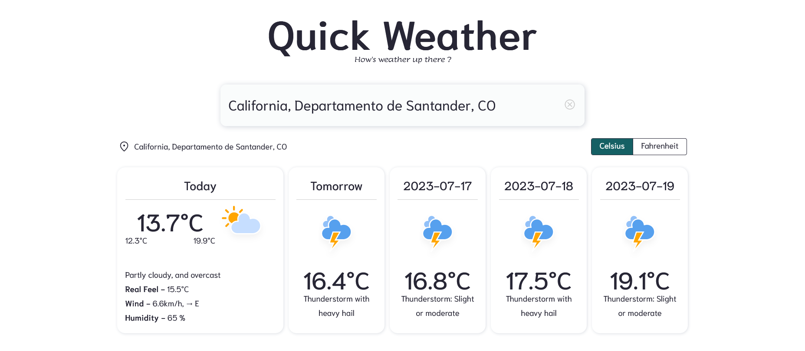

## About the project
* This project is built with react using [Open Meteo](https://open-meteo.com/en/docs) open source APIs for educational purpose only.

## Setup in your Local
* Clone the repository
* Open project directory in termial/powershell 
* Install node_modules using `npm install`
* Run development server using `npm start`
* Open `http://localhost:3000` and view the application

## Application Screenshot

## Author
- [Aman Sharma](https://github.com/iaman0004)